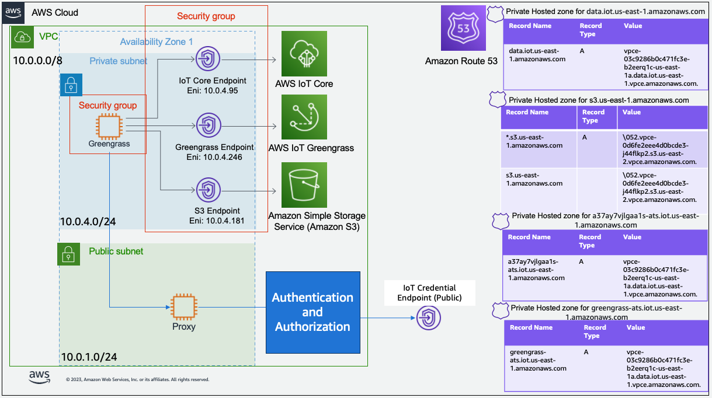

## AWS IOT Greengrass V2 Private Network and Proxy Allow Listing

If you'd like to keep your Greengrass V2 traffic private,
but also need to connect to public endpoints from Greengrass V2,
you can use a proxy server to limit traffic to endpoints you specify in an allowlist.
You can use this repository to build out your base VPC, VPC Endpoints, and Route53 infrastructure.
Additionally, this solution will launch an EC2 instance with [Tinyproxy](https://tinyproxy.github.io/) running as well
as one for Greengrass testing.

## Overview

This solution repository pairs with the AWS YouTube
series "How to use a Proxy Server to Connect to Public Endpoints for AWS IoT Greengrass V2" video
7/7, [Infrastructure as Code deployment with CDK (7/7)](#). You can watch this video for an explanation of the solution
and to follow along during installation.

---
**_NOTE:_** This sample is not setup for high availability (HA),
so if you need an HA configuration,
you'll need to configurate an autoscaling group and configura a load balancer as your proxy endpoint to make the proxy
highly available.
---

## Prequisites

Make sure you have the following tools installed, and an AWS account with permissions for Amazon Route53,
Amazon Virtual Private Cloud (VPC), Amazon Elastic Compute Cloud (EC2), AWS IOT Core, and AWS IOT Greengrass.

1. The [Python](https://www.python.org/downloads/) runtime, 3.9 or greater
1. The [JQ](https://jqlang.github.io/jq/) CLI
1. The [AWS CLI](https://aws.amazon.com/cli/) version 2
1. The [AWS CDK](https://docs.aws.amazon.com/cdk/v2/guide/getting_started.html) CLI
1. An [AWS Account](https://aws.amazon.com/resources/create-account/) with credentials
   for [CLI access](https://docs.aws.amazon.com/cli/latest/userguide/cli-chap-configure.html)

## Architecture



## Setup

Note that this has been tested on macOS. It should run without changes on Mac or Linux. On Windows, you may need to
make slight modifications.

Clone a copy of the repository.

```bash
git clone git@github.com:aws-samples/private-greengrassv2-proxy-connect-public-endpoints.git
cd private-greengrassv2-proxy-connect-public-endpoints
```

You can optionally create a Python virtual environment to isolate dependencies for this solution.

```bash
python3 -m venv .venv
source .venv/bin/activate
```

Next, install the required libraries.

```bash
pip install -r requirements.txt
```

## Deploy

Setup CDK deployment environment variables for your AWS account and AWS region.

```bash
export CDK_DEPLOY_ACCOUNT=$(aws sts get-caller-identity | jq -r .Account)
export CDK_DEPLOY_REGION=us-east-2
```

Now you are ready to bootstrap the CDK and deploy infrastructure.

```bash
cdk bootstrap
cdk deploy --require-approval never
```

## Setup Greengrass and Test

It is a good idea to watch the entire video
series [How to use a Proxy Server to Connect to Public Endpoints for AWS IoT Greengrass V2](https://www.youtube.com/playlist?list=PLi3dkyfu4cY1ZPmjTgzFa-cP27vfMAlqK)
to ensure you understand the full solution that you'll be installing. This solution pairs with the seventh video in the
series, [Infrastructure as Code deployment with CDK (7/7)](#). After installing this solution, you can jump to video 5
at the
[six-minute mark](https://youtu.be/DsyUdCwzu-M?list=PLi3dkyfu4cY1ZPmjTgzFa-cP27vfMAlqK&t=363) right before the GDK
installation to begin your testing. Note that the user_data script in this solution has already installed the Greengrass
Development Kit (GDK) for you so you.

## Security

See [CONTRIBUTING](CONTRIBUTING.md#security-issue-notifications) for more information.

## License

This library is licensed under the MIT-0 License. See the [LICENSE](LICENSE) file.

